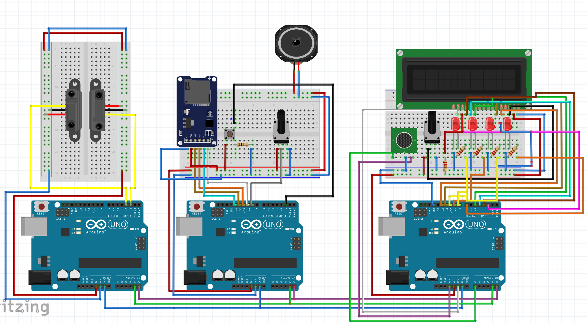

# CM12002 – Coursework 2: Automatic Disco System Project Report
## 1.0. Introduction to the Problem Area
The nightlife entertainment sector, particularly nightclubs and event spaces, has historically been characterized by high energy usage, with significant carbon footprints attributable to non-optimized lighting and sound systems. The challenge is compounded by the absence of systems that adapt to fluctuating occupancy levels, leading to a continuous and often unnecessary consumption of electricity. The motivation behind the development of an automatic disco system is to introduce a technological solution that not only addresses the issue of energy waste but also integrates seamlessly with the dynamic atmosphere that these venues aim to create. This system serves the dual purpose of enhancing environmental sustainability and providing an adaptable, responsive entertainment experience.

### 1.1. Motivation for Selecting the Problem Area 
The selection of this problem area is motivated by the imperative to reduce operational costs for entertainment venues while adhering to environmental regulations and sustainability goals. By employing a system that automatically adjusts music based on real-time occupancy, energy consumption is going to be substantially lowered, thus contributing to both ecological and economic benefits. Additionally, the feature that moderates sound levels resonates with the growing awareness of hearing health, positioning the system as a health-conscious innovation. This project also reflects the broader societal shift towards intelligent automation.

## 2.0. Literature and Technology Review
In this project, the concept of the Internet of Things (IoT) is central to achieving an intelligent and responsive nightclub environment. IoT describes devices with sensors, processing ability, software and other technologies that connect and exchange data with other devices and systems over the Internet or other communications networks [1]. Key components like infrared sensors for monitoring occupancy and microphones for noise level assessment are integral to this network. They provide critical real-time data, enabling the system to automatically adjust to varying conditions in the nightclub, such as modifying sound levels or managing the system’s use based on the number of attendees present. This approach exemplifies the utilization of IoT for enhancing operational efficiency and satisfying experience in dynamic public spaces.

The IoT plays a significant role in enhancing energy efficiency within buildings. Research has demonstrated that IoT can lead to substantial energy savings in commercial buildings. This technology, involving interconnected devices and sensors, is essential in optimizing energy use, especially in high-energy environments like nightclubs [2, 3].

Sound management is of paramount importance in such settings, due to the health implications of prolonged exposure to high noise levels. Studies show that excessive noise in nightclubs can lead to noise-induced hearing loss. Regulations require sound levels in work environments to be controlled, but nightclub attendees are often unaware of the risks associated with high noise levels [4, 5]. Implementing automated volume control systems in nightclubs is therefore crucial for protecting the health of the customers.

## 3.0. Development Process
### 3.1 Preparation Phase
Before commencing work on the project, multiple meetings were organized with the intention of allocating responsibilities and devising a plan. After agreeing unanimously on a certain number of features and their concrete implementation, it was decided that the group would split into pairs. Each pair took on a portion of the workload, which was then further divided between the two individuals in each group. This segmentation of the team facilitated efficient communication and enhanced workflow productivity.

### 3.2 Hardware Development Phase
The system comprises three Arduino boards: two "slave" boards and one "master". For autonomous operation, each group was allocated one slave and one master board, with the plan to later merge the two masters together. The master board, intended for placement in the club's DJ booth (refer to "Master", fig. 1), was initially designed to include five components: a speaker outside the booth, a play/pause button, manual volume control, an SD card reader, and an LCD screen displaying the current volume level. However, due to space constraints on the master board, the LCD screen was relocated to one of the slave boards (refer to "Slave 1", fig. 1). This slave board also features an array of LEDs for the lighting ("disco") system and a microphone for noise level monitoring. The second slave board (refer to "Slave 2", fig. 1) is equipped with two infrared sensors to count the number of people in the room, one at the entrance and one at the exit. While this setup may pose challenges in real-world scenarios with a single entrance, it can be addressed by placing a delimiter in the middle and allowing people to pass through one at a time after ID verification.

*Figure 1.*

### 3.3 Software Development Phase
Initially, the infrared sensors were set up using two interrupts. However, this approach encountered a problem: the interrupts did not trigger quickly enough, preventing the sensors from detecting people entering and exiting simultaneously. To overcome this challenge, the interrupts were removed. The software was redesigned to check for people coming in and out in the main loop every half a second, ensuring more accurate and reliable detection.

## 4.0. Final Implementation

*Figure 2.*

## 5.0. Conclusion and Future Improvements
- Jumper wires.
- LCD screen should be on master.

## 6.0. References
[1] “Internet of things”, Wikipedia, Available from: https://en.wikipedia.org/wiki/Internet_of_things [Accessed 5 December 2023].

[2] “Investigating energy savings when using IoT devices in buildings: a case study in the UK”, 2022 European Conference on Computing in Construction. Available from: https://www.researchgate.net/publication/362225733 [Accessed 5 December 2023].

[3] “Integration of IoT in building energy infrastructure: A critical review”, ScienceDirect. Available from: https://www.sciencedirect.com/science/article/pii/S1877050923002971 [Accessed 5 December 2023].

[4] “Excessive noise levels in nightclubs may cause noise-induced hearing loss”, Cambridge Core Blog, 2014. Available from: https://www.cambridge.org/core/blog/2014/02/25/turn-down-the-volume-an-examination-of-the-effects-of-nightclubs-on-hearing/ [Accessed 5 December 2023].

[5] “Noise Levels in Nightclubs May Increase Risk of Hearing Loss”, AOC, 2016. Available from: http://www.aocphysicians.com/blog/noise-levels-in-nightclubs-may-increase-risk-of-hearing-loss [Accessed 5 December 2023].
